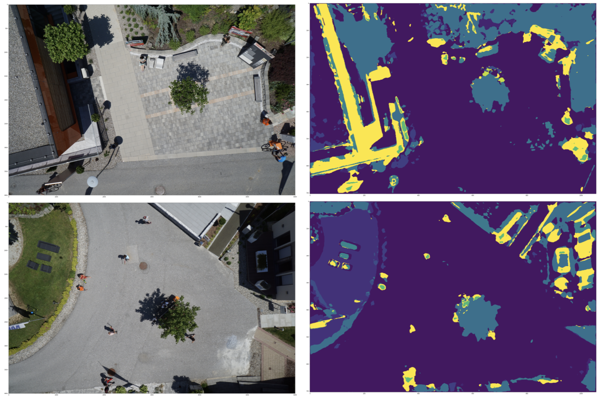

# segmentation
## Quick start
### Prerequisites
- Sklearn
- OpenCV for Python
- Pytorch ( recommended version : 1.7.1 )
### Installation
```bash
cd ./segment
make install
```
### Train
```bash
python3 train.py
```
### Test

```bash
python3 -m segment.eval model_path eval_res_path
```

## Introduction
### Metrics


| Backbone | Dice coefficient | Model                                                        |
| -------- | ---------------- | ------------------------------------------------------------ |
| Vgg16_BN | 24.56%         | ./weights/mode_split_best_loss_1.16645_epoch_17.pth |

###
#### Visualized results


#### Details
[link](https://github.com/tanxuehan/segment/blob/master/experiment.md)
