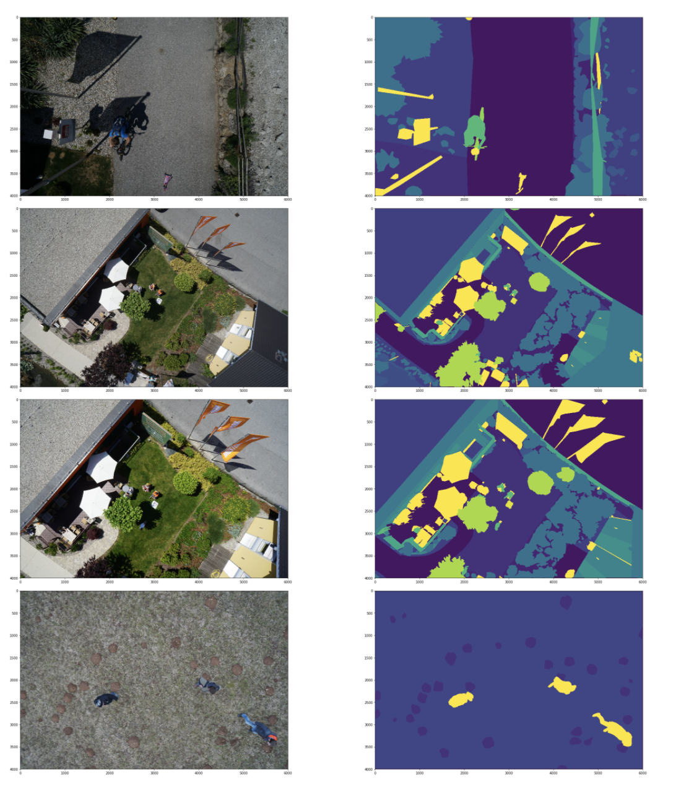

# 解决方案

## 数据分析

##### 图片size：

(4000, 6000, 3) (4000, 6000)

##### mask range：

(0,22)

##### 可视化：

## model

由于小物体较多，选择保留浅层信息和深层信息的Unet。

由于数据量较小，在选择pretrain model时，可采用参数量少的pretrain模型，这里采用vgg16_bn。

## experiment

#### loss function
ce loss
#### optimizer
采用同时考虑参数更新方向及速度的admaW优化器。
#### 其他
- 使用ImageNet的均值和标准差做归一化。
- 图片aug。
### 实验中进行优化的点
1. 初始实验中，设置Dice coefficient 3轮不增加则arly stop，实验结果发现Dice coefficient 只能达到0.1左右。查看log发现实验过早 early stop。尽管Dice coefficient不增加，但loss仍然在下降，在后续实验中，考虑数据量不大，可以不设置early stop，直接存储最优dice coff的model。
2. 初始实验中，由于评价指标为[Dice coefficient](https://en.wikipedia.org/wiki/Sørensen–Dice_coefficient)，loss function 采用与之对应的 dice loss，但收敛速度很慢，loss反复振荡，猜测主要由图像中小目标正样本较多，小目标的错误分类会会导致loss大幅度的变动，从而导致梯度变化剧烈。因此，后续实验中采用ce loss。

#### 其他后续调优中可用的trick：

- 分切train\valid 数据的不同fold，充分利用训练数据，做ensemble。

- 搜参。

- 采用不同backbone，做多模型ensemble。
