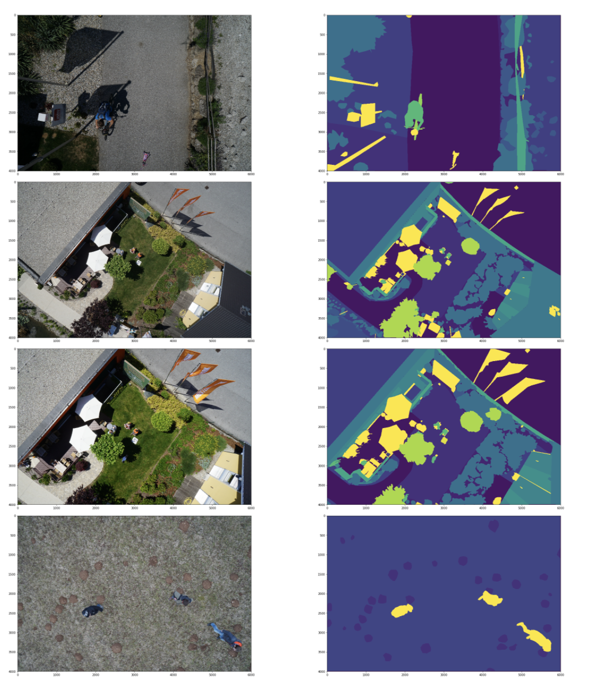

# segmentation

## 数据分析

##### 图片size：

(4000, 6000, 3) (4000, 6000)

##### mask range：

(0,22)

##### 可视化：

## model

### backbone

由于小物体较多，选择保留浅层信息和深层信息的Unet。

由于数据量较小，在选择pretrain model时，可采用参数量少的pretrain模型，这里采用resnet18。

### loss function

由于评价指标为[Dice coefficient](https://en.wikipedia.org/wiki/Sørensen–Dice_coefficient)，loss function 采用与之对应的 dice loss。

### optimizer

采用同时考虑参数更新方向及速度的adma优化器。

### trick

- 使用ImageNet的均值和标准差做归一化。
- 图片aug。

#### 其他后续调优中可用的track：

- 分切train\valid 数据的不同fold，充分利用训练数据。

- 搜参。

- 多模型ensemble。

## 

